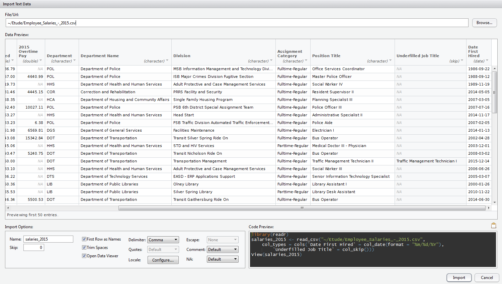
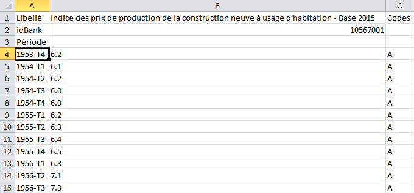

```{r setup, include=FALSE}
knitr::opts_chunk$set(echo = TRUE)
library(readr)
```

## Problématique

<!-- Est-ce qu'on sait s'il vaut mieux utiliser séparateur ou délimiteur dans le vocabulaire ?-->
Lire et écrire des fichiers texte où chaque enregistrement apparaît sur sa propre ligne et dont les champs sont séparés par un caractère unique appelé "séparateur" (ou "délimiteur"). Ce dernier peut correspondre à n'importe quel caractère absent des valeurs des champs, tel qu'une virgule ou un point-virgule (fichiers CSV), des espaces, ou un autre délimiteur.
<!-- http://www.thibault.laurent.free.fr/cours/R_avance/chapitre_1_avance.html#repertoires-et-fichiers -->

## Solution retenue

Le package **readr** offre un ensemble de fonctions permettant de lire les données d'un fichier délimité. La fonction la plus générale de ce package est la fonction `read_delim`, qui permet de spécifier le séparateur à utiliser lors de la lecture du fichier. Parallèlement, la fonction `write_delim` permet l'écriture d'un fichier texte avec séparateur. 

Ce package ne faisant pas partie de R de base, il est nécessaire de l'installer au préalable à l'aide de l'instruction `install.packages` (l'installation n'est à faire qu'une fois) et de le charger à chaque nouvelle ouverture de session R à l'aide de l'instruction `library`. 

```{r chargement_readr, eval=FALSE}
# Installer le package (une fois pour toutes)
install.packages("readr")
# Charger le package et les fonctions qu'il contient en mémoire (à faire à chaque fois, lors de l'ouverture d'une nouvelle session R)
library(readr)
```

Remarque : Nous présenterons ici uniquement les fonctions `read_delim` et `write_delim`. Ces fonctions sont plus générales et permettent de lire tout type de fichier avec séparateur. D'autres fonctions du package **readr** permettent de lire des types de fichiers spécifiques, comme par exemple les fonctions `read_csv` et `read_csv2` pour les fichiers CSV (ayant comme séparateur respectivement la virgule et le point-virgule).

## Particularité de syntaxe

<!-- Pas vraiment une spécificité du package, plutôt une spécificité de R, mais ça me semble important à préciser pour des débutants, surtout que SAS ne fonctionne pas pareil -->
Pour spécifier le chemin d'un fichier : contrairement à SAS où le backslash \\ indique le séparateur de répertoire, en R le séparateur de répertoire est indiqué par un slash / (pour tous les systèmes d'exploitations) ou par un double backslash \\\\ (sous Windows uniquement). Il faudra donc penser à modifier le chemin du répertoire si l'on copie colle ce dernier depuis l'explorateur. 

## Exemples

### Pour comparaison : code SAS pour l'importation de fichiers avec séparateurs

<!-- Est ce qu'on garde cette partie code SAS ? Car elle n'a pas l'air d'être évoquée par ailleurs dans les autres chapitres ? -->

En SAS, l'importation de fichiers avec un séparateur peut s'effectuer au moyen d'une étape DATA avec l'instruction INFILE ou bien avec la PROC IMPORT. 
Dans cet exemple, le fichier lu est au format CSV (comma separated value), dont le séparateur est une virgule. 

```{r delim_csv_sas, engine="sas", eval=FALSE}
data donnees;
  infile 'repertoire\fichier.csv' dlm=","
  input variable1 ... variablek ;
run;
```

```{r delim_csv_sas2, engine="sas", eval=FALSE}
proc import datafile="repertoire\fichier"
  out = ds dbms="csv";
  delimiter=",";
  getnames="yes";
run;
```

### Importer un fichier avec l'interface graphique de RStudio

RStudio permet d'importer des fichiers avec séparateurs depuis le panneau "Environment" en haut à droite, en cliquant sur *Import Dataset > From CSV...*
Une autre option est d'utiliser le menu : *File> Import Dataset > From CSV...*

Dans ce premier exemple, nous allons importer la table listant les salaires en 2015 des employés gouvernementaux du comté de Montgomery, aux États-Unis, téléchargeable à l'adresse ci-dessous : 

https://data.montgomerycountymd.gov/api/views/6rqk-pdub/rows.csv?accessType=DOWNLOAD 



Le fichier a été sélectionné depuis l'explorateur de fichiers, via la barre "File/Url" (Browse).
Dans le panneau "Import options" (en bas), le champ "Name" permet de spécifier le type des variables. Nous avons changé le type de la dernière colonne (Date First Hired) en "date", une boîte de dialogue demande alors de préciser le format pour la date : il s'agit ici du format `%m/%d/%Y` qui correspond à une format de date mois/jours/année. Nous avons également choisi de ne pas importer l'avant-dernière colonne ("Underfilled Job Title"), avec l'option "Skip".  
Il suffit ensuite de cliquer sur le bouton "Import" pour lire le fichier et obtenir notre table. 


L'assistant offre de nombreuses possibilités et permet de prévisualiser les effets des différentes options lors de la lecture du fichier. Le code obtenu à l'issue de l'importation pourra être copié collé par la suite dans un script, pour garder une trace écrite de l'importation de la table et rendre les codes plus reproductibles.
Cependant, l'assistant n'offre parfois que des possibilités de personnalisation limitées dans les menus, et la prévisualisation peut être longue si le fichier à importer est de taille conséquente. 

Action souhaitée | Où dans l'assistant ? | Commentaire
------------- | ----------------  | ---------------------------------------
Importer un fichier  | Champ "File/Url"   | Il est possible d'importer un fichier depuis l'ordinateur, en cliquant sur "Browse" et en choisissant le fichier depuis l'explorateur. Il est également possible d'importer le fichier directement depuis une URL à condition d'être connecté à Internet et que le fichier soit sur une page dédiée. 
Choisir le nom de la table à créer | Panneau Import options>Name | Vous pouvez donner le nom souhaité à votre table dans ce champ. Un nom de table valide peut contenir des lettres, des chiffres, des points et des underscores \_, et commence par une lettre. 
Ne pas lire les premières lignes du fichier | Panneau Import options>Skip | Par défaut, toutes les lignes du fichier seront lues (skip=0). Sinon, il suffit de préciser le numéro de la ligne à partir de laquelle on souhaite lire le fichier. 
Utiliser la première ligne du fichier pour nommer les colonnes | Panneau "Import options"> case "First row as names" | Par défaut, la première ligne du fichier définit le noms des colonnes de la future table. Sinon, le nom des colonnes sera généré automatiquement : X1, X2, X3, etc. Il sera possible de renommer les colonnes ultérieurement. 
Supprimer les espaces en début et en fin d'une chaîne de caractère | Panneau "Import options"> case "Trim Spaces" | Si cette option est cochée, les espaces au début et à la fin d'une chaîne de caractère seront supprimés
Choisir le séparateur du fichier | Panneau "Import options">Delimiter | Le menu permet de choisir un séparateur qui peut-être la virgule (comma), le point-virgule (semicolon), la tabulation (tab), ou un espace (whitespace). **Attention**, pour un fichier CSV dont le séparateur est le point virgule, il faudra également modifier le type de décimale dans le panneau "Import options">Locale>Configure...>Decimal Mark" en entrant une virgule à la place du point. 
Visualiser la table importée | Panneau Import options> case "Option Data Viewer" | Par défaut, la table sera visualisée après son importation, ce qui est utile pour vérifier que le résultat correspond bien aux attentes. 
Modifier le type des colonnes | Panneau "Data Preview" | Par défaut, le type de chaque colonne est "deviné" à partir des premières lignes du fichier et s'affiche sous le nom de chaque variable. Il est possible de modifier le type d'une colonne en cliquant sur son type. Les types de colonnes existants sont résumés dans le tableau de la section "Spécifier le type de colonnes" plus bas dans ce document. Les plus courants sont integer (nombre entier), double (nombre réel) et character (chaîne de caractères). 
Ne pas importer certaines colonnes | Panneau "Data Preview" | Par défaut, toutes les colonnes du fichier seront importées dans la future table. Pour exclure une colonne particulière, cliquer sur le type de la variable et choisir "Skip" plutôt que "Include".
Modifier l'encodage | Panneau "Import options">Locale>Configure...>Encoding | Si les caractères accentués s'affichent bizarrement, il faut essayer de modifier l'encodage. Par défaut, le package considère que le fichier lu est encodé en UTF-8.
Préciser le caractère correspondant aux valeurs manquantes | Panneau "Import options">NA | Un menu déroulant permet de spécifier si nécessaire la chaîne de caractère qui correspond à une valeur manquante. 


### La fonction *read_delim* du package *readr*

La fonction `read_delim` a pour arguments obligatoires l'emplacement du fichier à lire et le type de délimiteur du fichier. 

```{r syntaxe read_delim, eval=FALSE}
ma_table<-read.delim(file="chemin_du_fichier", delim="separateur_du_fichier")
```
D'autres arguments optionnels permettront de spécifier comment lire le fichier. 

#### Quel délimiteur retenir ? 

L'argument `delim` permet de spécifier le séparateur de champs dans le fichier. Les plus fréquents sont : 

Fichier | Séparateur | Argument delim | Commentaire
------------------- | -------- | ----- | -------------------------------------
CSV (comma-separated values) | virgule | , | Le séparateur de décimale est le point
CSV "à l'européenne" | point-virgule | ; | Attention à préciser que le séparateur de décimales est la virgule, à l'aide de l'argument `locale= locale(decimal_mark = ",")`
TSV (tab-separated values) | tabulation | \\t | 
Fichier texte utilisant des espaces comme délimiteur | espace | " \" | 

<!-- Mettre éventuellement un exemple avec CSV2 en spécifiant de le télécharger sur github 
Sinon chercher des liens vers mtcars.csv ? Pb : pas de décimales ! Est ce que dans datasets il y a qch avec les décimales ? -->

#### Spécifier le type des colonnes : l'argument col_types

La fonction `read_delim` détermine automatiquement le type à attribuer (exemple : entier) aux colonnes du fichier, en analysant les 1000 premières lignes. Les types de colonnes attribués sont précisés après l'exécution de la fonction. On peut également y accéder avec la fonction `spec`.

Prenons l'exemple de la table *mtcars*, dont le fichier CSV (dont le séparateur est la virgule) se situe dans les fichiers d'exemple du package **readr**. 

```{r colonnes_ok, echo=TRUE}
table<-read_delim(readr_example("mtcars.csv"), delim=",") # Lecture du fichier CSV
head(table) # Affichage des premières lignes de la table
#spec(table) # Afficher les types de colonnes retenus lors de la lecture du fichier
```

Cependant, le choix effectué automatiquement pour les types de colonnes peut-être insatisfaisant. Les 1000 premières lignes du fichier peuvent en effet correspondre à un cas particulier. Dans ce cas, le type de colonne déterminé par défaut n'est soit pas assez général (par exemple une colonne de nombres réels mais dont les 1000 premières lignes seraient des entiers), soit trop général (si les 1000 premières lignes correspondent à des valeurs manquantes, la colonne sera définie comme une colonne de type caractère alors qu'on aurait souhaité que ça soit des nombres entiers). 

Dans l'exemple de la base officielle des codes postaux, le fichier comprend en première colonne le code commune INSEE. Ce fichier est téléchargeable à l'adresse ci-dessous :  

https://www.data.gouv.fr/fr/datasets/r/554590ab-ae62-40ac-8353-ee75162c05ee

Pour montrer ce qu'il peut se passer lorsque le type de colonnes est mal identifié, nous utilisons l'argument `guess_max=500` qui va permettre à la fonction de "deviner" automatiquement le type de chaque colonne à partir des 500 premières lignes du fichier. Notons que pour ce fichier, le séparateur est un point-virgule.  

<!-- Malheureusement je n'ai pas trouvé d'exemple permettant d'éviter l'argument guess_max -->
```{r pb_colonnes, echo=TRUE}
codes_postaux <- read_delim("~/laposte_hexasmal.csv", delim=";", guess_max=500)
```

La fonction affiche un avertissement nous indiquant qu'il y a eu plusieurs problèmes lors de la lecture du fichier (parsing failures). Ces problèmes sont ajoutés en attributs de la table `code_postaux`. Ils s'affichent avec la fonction `problems`. 

```{r pb_colonnes_fct, echo=TRUE}
problems(codes_postaux)
```

La fonction `problems` nous indique qu'il y a eu ici 418 problèmes de lecture. Les colonnes `row` et `col` indiquent la ligne et la colonne où il y a eu une erreur. Ici, la première erreur est survenue à la ligne 598 de notre fichier, pour la variable `Code_commune_INSEE`. La colonne `expected` indique ce que la fonction s'attendait à trouver et la colonne `actual` indique ce qu'elle a réellement trouvé. La colonne `Code_commune_INSEE` avait été assignée comme une colonne de type entier (`integer`). La fonction s'attendait donc à trouver dans cette colonne uniquement des chiffres et pas d'autres caractères (en d'autres termes, "no trailing characters" était attendu par la fonction). Comme ce n'est pas le cas ici, cela sous-entend que le type de la colonne `Code_commune_INSEE` a été mal spécifié et qu'il ne s'agit pas d'une colonne de nombres entiers. 

Il faut alors spécifier le type de la colonne lors de la lecture, à l'aide de l'argument `col_types`. 
Ici, nous spécifions que les variables "Code_commune_INSEE" et Code_postal doivent être lues comme des variables de type caractère. Le type des autres colonnes est toujours deviné automatiquement. 

```{r type_colonnes}
codes_postaux <- read_delim("~/laposte_hexasmal.csv", delim=";", guess_max=500,
                            col_types=cols(Code_commune_INSEE=col_character(),
                                           Code_postal=col_character()
                                           )
                            )
head(codes_postaux)
```

Comme nous n'avons pas beaucoup de variables, nous aurions également pu spécifier le type de chaque colonne à l'aide d'alias : 

<!-- Peut être qu'en fait l'alias porte à confusion et qu'il faudrait le supprimer ?-->
```{r type_col_alias, eval=FALSE}
codes_postaux <- read_delim("~/laposte_hexasmal.csv", delim=";", guess_max=500,
                            col_types="cccccc"
                            )
head(codes_postaux)
```

Les principaux types de colonnes et leurs alias sont récapitulés ci-dessous. 

Fonction  | Type  | Alias
------------- | -------------  | -------------
col_integer()  | Nombre entier   | "i"
col_double()  | Nombre réel   | "d"
col_logical()  | Booléen (vrai ou faux)   | "l"
col_character()  | Chaîne de caractère   | "c"
col_factor()  | Facteur   | "f"
col_date()  | Date | "D"
col_datetime()  | Date et heure   | "T"
col_time()  | Heure   | "t"
col_skip()  | Ne pas lire la colonne | "-" ou "_"
col_number()  | Numérique   | "n" 

**Attention**, le type "numérique" (col_number) supprime tout caractère non numérique avant ou après le premier chiffre, et ne permet donc pas de conserver les décimales.

Pour les dates, il est possible de préciser le format, par exemple `col_date(format="%m/%d/%y")` pour une date au format mois/jour/année. 

<!-- Vérifier si numeric ça passe avec les décimales, à défaut faire un avertissement -->

#### Spécifier les colonnes à ne pas lire

Pour ne pas lire une colonne, son type doit être `col_skip`. En reprenant l'exemple précédent et en choisissant de ne pas lire la variable "Ligne5" :

```{r type_col_skip}
codes_postaux <- read_delim("~/laposte_hexasmal.csv", delim=";", guess_max=500,
                             col_types=cols(Code_commune_INSEE=col_character(),
                                           Code_postal=col_character(),
                                           Ligne_5=col_skip()
                                           )
                            )
head(codes_postaux)
```

#### Ne pas lire les lignes au début du fichier

Si la table de données ne commence pas dès la première ligne du fichier, il peut-être utile de ne démarrer la lecture qu'à partir d'une certaine ligne. L'option `skip` indique le nombre de lignes à sauter avant de lire les données. 

Par exemple, nous souhaitons lire les données de la table ci-dessous à partir de la ligne 4. Comme nous lisons uniquement les données, nous précisons que la première ligne lue ne correspond pas à des noms de variables avec l'argument `col_names=FALSE`.


```{r ligne_skip}
table <- read_delim("~/valeurs_trimestrielles.csv", delim=";", skip=3, col_names=FALSE)
head(table)
```

#### Changer le nom des colonnes

Par défaut, la première ligne lue dans le fichier est utilisée pour le nom des colonnes. Si on ne souhaite pas utiliser la première ligne pour définir le nom des colonnes, il faut préciser `col_names=FALSE`. Dans ce cas, le nom des colonnes est généré automatiquement : X1, X2, X3, etc. 

Si on veut définir soit même le nom des variables, il faut que l'argument `col_names` corresponde à un vecteur de caractères. Par exemple, nous souhaitons nommer les colonnes "date", "ipp" et "codes".

```{r}
table <- read_delim("~/valeurs_trimestrielles.csv", delim=";", skip=3, col_names=c("date", "ipp", "codes"))
head(table)
```


#### Gestion des caractères accentués : modifier l'encodage avec l'argument locale

Il arrive parfois qu'après la lecture d'un fichier, les accents ne s'affichent pas correctement.Dans le fichier ci-dessous de la nomenclature produit utilisée par les douanes, les libellés des lignes 4 et 6 ne s'affichent pas correctement.

```{r mauvais_encodage, echo=TRUE}
codes_nc8<-read_delim("https://lekiosque.finances.gouv.fr/fichiers/guide/NC8_TXT.CSV", delim=";")
head(codes_nc8)
```
L'encodage du fichier n'est alors probablement pas l'encodage UTF-8. Il faut alors spécifier l'encodage à l'aide de l'argument `locale`. Si nous ne connaissons pas au préalable l'encodage du fichier, la fonction `guess_encoding` peut aider à le déterminer. Elle prend comme argument le chemin du fichier dont l'encodage est à déterminer. 

```{r guess_encoding, echo=TRUE}
guess_encoding("https://lekiosque.finances.gouv.fr/fichiers/guide/NC8_TXT.CSV")
```
La fonction renvoie une liste avec des encodages classés par ordre de plausibilité. Ici, l'encodage semble être le windows-1252. Nous allons donc pouvoir le renseigner dans le paramètre `locale` de la fonction `read_delim`.

```{r bon_encodage, echo=TRUE}
codes_nc8<-read_delim("https://lekiosque.finances.gouv.fr/fichiers/guide/NC8_TXT.CSV", delim=";", locale=locale(encoding="windows-1252"))
head(codes_nc8)
```
Cette fois-ci, les caractères accentués s'affichent correctement. 

#### Exporter une table

La fonction `write_delim` permet l'exportation d'une table dans un fichier délimité. Il faut préciser la table à exporter, l'emplacement du fichier en sortie, le délimiteur retenu. 

```{r}
df<- data.frame("Date" = Sys.Date()-0:4,
           "Code" = sample(letters, 5),
           "Nombre" = round(runif(5)*10, digits=2))
write_delim(df, "~/table_exportee.csv", delim=",")
```


## Solutions viables non retenues

<!-- Parler des autres fonctions du package readr ? --> 

### Le package data.table

La fonction **fread** du package **data.table** est efficace en termes de performances. Cette fonction permet une lecture des fichiers beaucoup plus rapide que les fonctions de R de base, notamment lorsque la taille du fichier augmente.

Toutefois, cette solution a été écartée en raison d'une moindre compatibilité avec le reste des outils préconisés. 

```{r delim data.table, eval=FALSE}
library(data.table)
# Lecture d'un fichier CSV (séparateur : ",")
donnees<-fread("repertoire/fichier.csv", sep=",")
# Lecture d'un fichier CSV avec des options supplémentaires
donnees<-fread("repertoire/fichiers.csv", sep=",", header=TRUE, colClasses=, skip=3, nrows=10, na.strings=c(" ", "NA"))
# Exportation d'un fichier CSV (séparateur : ",")
fwrite(donnees, "repertoire/fichier_sortie.csv")
```


### R de base

R dispose par défaut de plusieurs fonctions pour lire des fichiers délimités, la plus générale étant read.table. Les fonctions read.csv et read.csv2 sont un raccourci de read.table et permettent de lire des fichiers CSV. 

```{r delim rbase, eval=FALSE}
# Lecture d'un fichier CSV (séparateur : "," et décimales : ".")
donnees<-read.table("C:/repertoire/fichier.txt", sep=",", dec=".", stringsAsFactors = FALSE)
# Lecture d'un fichier CSV avec plus d'options
donnees<-read.table("C:/repertoire/fichier.txt", sep=",", dec=".", stringsAsFactors = FALSE, col.names=c("A", "B", "C", "D", "E"), colClasses=c("numeric", "character", "character", "character", "Date"), skip=3, nrows=10, na.strings = c(" ", "NA"))
```

L'option stringAsFactors = FALSE permet d'empêcher la création automatique de facteurs lors de la lecture de variables caractères. Les facteurs correspondent en réalité à des variables numériques avec des labels, dans l'optique de gagner de la place en mémoire. Par exemple, pour une variable avec les valeurs "homme" et "femme", R stocke les valeurs 1 et 2 et leur attribue le label correspondant.

Contrairement aux fonctions des packages **readr** et **data.table**, les fonctions de R de base parcourent les colonnes entièrement pour déterminer leurs types (et non uniquement les premières lignes), ce qui peut entraver les performances lors de la lecture de gros fichiers. Pour améliorer les performances, il est conseillé de spécifier à l'avance le type des colonnes ainsi que le nombre de lignes à lire. Toutefois, même en spécifiant ces paramètres, ces fonctions sont moins performantes pour les gros fichiers que les fonctions des packages **readr** et **data.table**.

<!-- ## Package iotools ? -->

## Solutions à ne pas utiliser

Aucune. 

## Niveau d'intégration à l'USSR

### Développements préconisés

Aucun.

### Points de vigilance

Aucun.

## Intégration au dispositif de formation

La question est abordée dans la formation "Prise en main rapide de données sous R", lors de la séquence 9 ("formats de fichiers d'échange").

## Pour aller plus loin

Vignettes du package readr :

* https://cran.r-project.org/web/packages/readr/vignettes/readr.html
* https://cran.r-project.org/web/packages/readr/vignettes/locales.html
